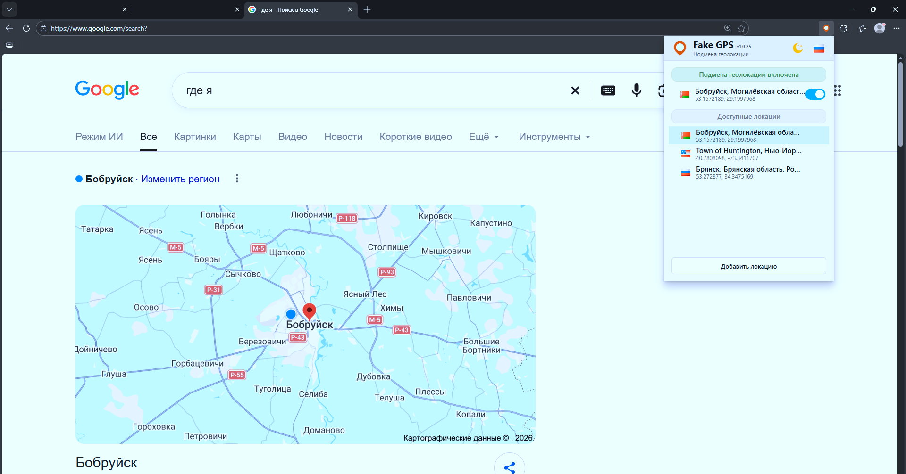

# Fake GPS

Расширение для Chromium-браузеров, которое позволяет подменять геолокацию сайтов и быстро переключаться между сохранёнными точками.

## Возможности

- включение и отключение подмены геолокации прямо из popup;
- сохранение нескольких локаций;
- быстрое переключение между сохранёнными точками;
- отдельное окно выбора точки на карте;
- поиск локации по названию;
- ручной ввод широты и долготы;
- выбор координат кликом по карте;
- масштабирование карты колесом мыши относительно позиции курсора;
- редактирование и удаление сохранённых локаций;
- отображение флага страны для активной и сохранённых локаций;
- светлая и тёмная темы;
- русский и английский интерфейс.

## Установка

1. Откройте страницу расширений браузера:
   - Chrome: `chrome://extensions/`
   - Edge: `edge://extensions/`
2. Включите **Режим разработчика**.
3. Нажмите **Загрузить распакованное расширение**.
4. Выберите папку проекта `FAKEGPS-EXT`.

После установки значок Fake GPS появится на панели расширений браузера.

## Использование

### Включение подмены геолокации

Откройте popup расширения и включите переключатель у активной локации.

После этого сайты, использующие Browser Geolocation API, будут получать выбранные координаты вместо реального местоположения.

Повторное нажатие на активную локацию или выключение переключателя отключает подмену.

### Добавление локации

Нажмите **Добавить локацию** в нижней части popup.

Откроется отдельное окно карты, где можно:

- найти место по названию;
- ввести широту и долготу вручную;
- выбрать точку непосредственно на карте.

После выбора нажмите **Применить**. Локация будет сохранена и сразу станет активной.

### Редактирование локации

Наведите курсор на сохранённую локацию и нажмите значок редактирования.

Откроется то же окно карты, где можно изменить выбранную точку.

### Удаление локации

Наведите курсор на сохранённую локацию и нажмите **×**.

Перед удалением расширение покажет подтверждение.

## Карта

Для отображения карты используются тайлы OpenStreetMap.

Поиск по названию и определение названия выбранной точки выполняются через Nominatim.

© OpenStreetMap contributors

## Как работает подмена

Расширение подменяет Browser Geolocation API на страницах:

- `navigator.geolocation.getCurrentPosition()`
- `navigator.geolocation.watchPosition()`

Когда подмена выключена, используется обычная геолокация браузера.

Для запросов Google дополнительно формируется GEO-заголовок с выбранными координатами через `declarativeNetRequest`.

Настройки, сохранённые локации, тема и язык хранятся в `chrome.storage.sync`.

## Поддерживаемые браузеры

Расширение предназначено для Chromium-браузеров с поддержкой Manifest V3, например:

- Google Chrome;
- Microsoft Edge;
- другие Chromium-браузеры с совместимой реализацией расширений.

## Структура проекта

- `manifest.json` — конфигурация расширения;
- `background.js` — service worker и GEO-заголовки;
- `geolocation_spoof.js` — подмена Geolocation API в контексте страницы;
- `geolocation_bridge.js` — синхронизация настроек со страницей;
- `popup.html` / `popup.js` — основное окно расширения;
- `map_picker.html` / `map_picker.js` — отдельное окно выбора координат;
- `_locales/` — локализация;
- `img/` — иконки и флаги;
- `files/screen.png` — скриншот интерфейса.

## Примечание

Некоторые сайты могут использовать собственные способы определения местоположения, например IP-адрес, данные аккаунта или серверные сигналы. Подмена Browser Geolocation API не изменяет IP-адрес пользователя.
